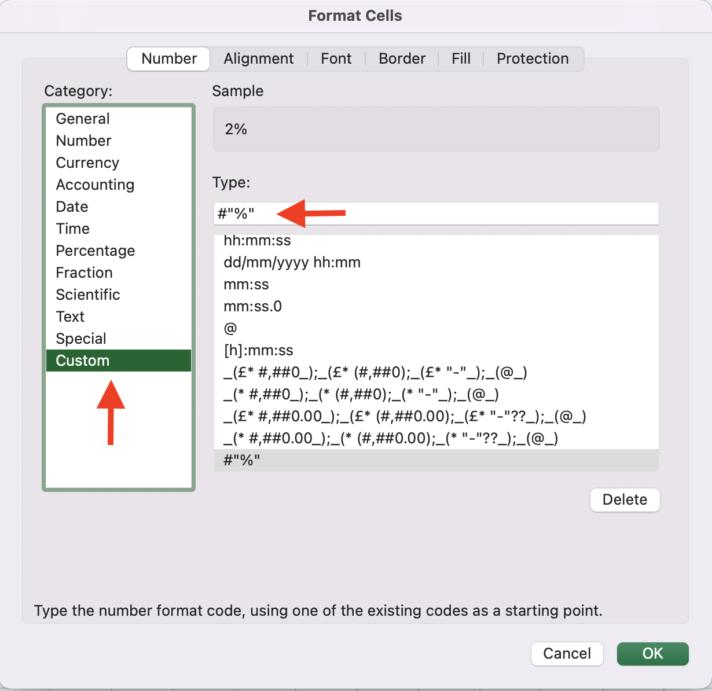

PHP-XLSXWriter
==============

### Use:
* `ZipArchive`, based on PHP's [Zip extension](http://fr.php.net/manual/en/book.zip.php)

### Simple XLSX output generator
* supports PHP 7.0.0+
* takes UTF-8 encoded input
* multiple worksheets
* supports cell styling
* supports merged cells
* supports images (png, jpg, jpeg)
* supports charts (Line chart, Bar chart, Pie chart)
* supports writing huge row sheets [(Check Huge Data Example)](./examples/example_huge_data.php)

# Installation

```
composer require pfurak/xlsx-writer
```

# Simple PHP CLI example:
```php
use XLSXWriter\Export;

$sheetName = "sheet1";
$maxRow = 3;
$maxCol = 10;

$export = new Export("export.xlsx");

for($row = 0; $row < $maxRow; $row++) {
    for($col = 0; $col < $maxCol; $col++) {
        $value = $row + $col;
        $export->addField($sheetName, $row, $col, $value);
    }
}

$export->saveOnDisk(__DIR__);
unset($export);
```

# Simple PHP browser example:
```php
use XLSXWriter\Export;

$sheetName = "sheet1";
$maxRow = 3;
$maxCol = 10;

$export = new Export("export.xlsx");

for($row = 0; $row < $maxRow; $row++) {
    for($col = 0; $col < $maxCol; $col++) {
        $value = $row + $col;
        $export->addField($sheetName, $row, $col, $value);
    }
}

$export->download();
unset($export);
```

# Simple style example:
```php
use XLSXWriter\Export;
use XLSXWriter\Fill;
use XLSXWriter\Font;
use XLSXWriter\Border;

$fill = new Fill("solid", ["from" => "string", "value" => "black"]);
$font = new Font([
    "size"      =>  12,
    "name"      =>  "Helvetica",
    "bold"      =>  true,
    "italic"    =>  true,
    "underline" =>  true,
    "color"     =>  [
        "from"  =>  "hex",
        "value" =>  "6EF0EB"
    ]
]);

$alignment = [
    "horizontal"    =>  "center",
    "vertical"      =>  "center",
    "wrapText"      =>  "1",
    "textRotation"  =>  "90"
];

$borderColor = [
    "from" => "rgb",
    "value" => [
        "red" => 0,
        "green" => 125,
        "blue" => 125
    ]
];

$border = new Border([
    "left"  =>  [
        "style" =>  "medium",
        "color" =>  $borderColor
    ],
    "diagonal"  =>  [
        "style" =>  "medium",
        "color" =>  $borderColor
    ],
    "diagonalUp"    =>  true,
    "diagonalDown"  =>  true,
]);

$style = [
    "fill"          =>  $fill,
    "font"          =>  $font,
    "alignment"     =>  $alignment,
    "numberFormat"  =>  "##\%",
    "border"        =>  $border
]

$sheetName = "sheet1";
$maxRow = 3;
$maxCol = 10;

$export = new Export("export.xlsx");

for($row = 0; $row < $maxRow; $row++) {
    for($col = 0; $col < $maxCol; $col++) {
        $value = $row + $col;
        $export->addField($sheetName, $row, $col, $value, $style);
    }
}

$export->saveOnDisk(__DIR__);
unset($export);
```

# Simple image example:
```php
use XLSXWriter\Export;

$imgDir = "./images/";
$images = [[
    "file"  =>  $imgDir . "img.png",
    "row"   =>  0,
    "col"   =>  0
], [
    "file"  =>  $imgDir . "img_2.png",
    "row"   =>  0,
    "col"   =>  2
], [
    "file"  =>  $imgDir . "img_3.png",
    "row"   =>  0,
    "col"   =>  4
]];

$sheetName = "sheet1";

$export = new Export("export.xlsx");
foreach($images as $image) {
    $export->addImage($sheetName, $image['file'], $image['row'], $image['col']);
}

$export->saveOnDisk(__DIR__);
unset($export);
```

# Simple line chart example:
```php
use XLSXWriter\Export;
use XLSXWriter\Chart\LineChart\LineChart;
use XLSXWriter\Chart\LineChart\Line;

$sheetName = "sheet1";
$style = ["numberFormat" => "#,##0.00\ [\$Ft-hu-HU]"];

$EURToHUF = ["EUR TO HUF", 380.71, 381.92, 382.10, 382.56, 378.65];
$USDToHUF = ["USD TO HUF", 362.15, 362.15, 362.15, 365.00, 360.87]; 
$dates = ["Date", "2022.05.06.", "2022.05.07.", "2022.05.08.", "2022.05.09.", "2022.05.10."];

$data = [$EURToHUF, $USDToHUF, $dates];
$maxRow = count($data);

$export = new Export("export.xlsx");

$chart = new LineChart();
$chart->setTitle("EUR (€) & USD ($) to HUF (Ft)");
$chart->setPosition($maxRow, 0);
$chart->setXAxis($sheetName, $maxRow - 1, 1, count($data[$maxRow - 1]) - 1);
$chart->setShowLegend(true);
$chart->setLegendPosition('b'); // bottom

for($row = 0; $row < $maxRow; $row++) {
    $dataRow = $data[$row];
    $maxData = count($dataRow);
    for($col = 0; $col < $maxData; $col++) {
        $value = $dataRow[$col];
        $s = $col > 0 && $row < $maxRow - 1 ? $style : [];
        $export->addField($sheetName, $row, $col, $value, $s);
    }

    if($row < $maxRow - 1) {
        $line = new Line();
        $line->setTitle($sheetName, $row, 0);
        $line->setData($sheetName, $row, 1, $maxData - 1);
        $chart->addLine($line);
    }
}

$export->addChart($sheetName, $chart);
$export->saveOnDisk(__DIR__);
unset($export);
```

# Simple bar chart example:
```php
use XLSXWriter\Export;
use XLSXWriter\Chart\BarChart\BarChart;
use XLSXWriter\Chart\BarChart\Bar;

$sheetName = "sheet1";
$style = ["numberFormat" => "#,##0.00\ [\$Ft-hu-HU]"];

$EURToHUF = ["EUR TO HUF", 380.71, 381.92, 382.10, 382.56, 378.65];
$USDToHUF = ["USD TO HUF", 362.15, 362.15, 362.15, 365.00, 360.87]; 
$dates = ["Date", "2022.05.06.", "2022.05.07.", "2022.05.08.", "2022.05.09.", "2022.05.10."];

$data = [$EURToHUF, $USDToHUF, $dates];
$maxRow = count($data);

$export = new Export($output);

$chart = new BarChart();
$chart->setTitle("EUR (€) & USD ($) to HUF (Ft)");
$chart->setPosition($maxRow, 0);
$chart->setXAxis($sheetName, $maxRow - 1, 1, count($data[$maxRow - 1]) - 1);
$chart->setShowLegend(true);
$chart->setLegendPosition('r'); // right

for($row = 0; $row < $maxRow; $row++) {
    $dataRow = $data[$row];
    $maxData = count($dataRow);
    for($col = 0; $col < $maxData; $col++) {
        $value = $dataRow[$col];
        $s = $col > 0 && $row < $maxRow - 1 ? $style : [];
        $export->addField($sheetName, $row, $col, $value, $s);
    }

    if($row < $maxRow - 1) {
        $bar = new Bar();
        $bar->setTitle($sheetName, $row, 0);
        $bar->setData($sheetName, $row, 1, $maxData - 1);
        $chart->addBar($bar);
    }
}

$export->addChart($sheetName, $chart);
$export->saveOnDisk(__DIR__);
unset($export);
```

# Simple pie chart example:
```php
use XLSXWriter\Export;
use XLSXWriter\Chart\PieChart\PieChart;

$sheetName = "sheet_1";
$legends = ["PHP", "React", "nodeJS", "TypeScript", "vue.js", "next.js"];
$data    = [   45,      40,       35,           30,       25,        20];

$export = new Export($output);

$row = 0;
for($i = 0; $i < count($legends); $i++) {
    $col = 0;
    $legend = $legends[$i];
    $legendData = $data[$i] ?? 0;

    $export->addField($sheetName, $row, $col++, $legend);
    $export->addField($sheetName, $row, $col, $legendData);

    $row++;
}

$chart = new PieChart();
$chart->setTitle("Lovers of the languages");
$chart->setPosition($row, 0);
$chart->setShowLegend(true);
$chart->setLegendPosition('b');
$chart->setLegend($sheetName, 0, $row - 1, 0, 0);
$chart->setPies($sheetName, 0, $row - 1, 1, 1);

$export->addChart($sheetName, $chart);

$sheetName = "sheet_2";
$row = 0;
$col = 0;
foreach($legends as $legend) {
    $export->addField($sheetName, $row, $col++, $legend);
}

$row++;
$col = 0;
foreach($data as $legendData) {
    $export->addField($sheetName, $row, $col++, $legendData);
}
$row++;

$chart = new PieChart();
$chart->setTitle("Lovers of the languages");
$chart->setPosition($row, 0);
$chart->setShowLegend(true);
$chart->setLegendPosition('r');

$chart->setLegend($sheetName, 0, 0, 0, count($legends) - 1);
$chart->setPies($sheetName, 1, 1, 0, count($data) - 1);

$export->addChart($sheetName, $chart);

$export->saveOnDisk(__DIR__);
unset($export);
```

# Supported Styles
## Font
| Key Prop    | Default   | Description                      |
| :---------- | :-------- | -------------------------------- |
| `size`      | `12`      | Font size in PT                  |
| `name`      | `Calibri` | Font name                        |
| `color`     |           | Font color (see colors)          |
| `vertalign` |           | `"superscript"` or `"subscript"` |
| `bold`      | `false`   | `true` or `false`                |
| `italic`    | `false`   | `true` or `false`                |
| `underline` | `false`   | `true` or `false`                |
| `strike`    | `false`   | `true` or `false`                |

## Alignment
| Key Prop       | Default  | Description                         |
| :------------- | :------- | ----------------------------------- |
| `horizontal`   | `left`   | `"left"` or `"center"` or `"right"` |
| `vertical`     | `bottom` | `"top"` or `"center"` or `"bottom"` |
| `wrapText`     | `false`  | `true` or `false`                   |
| `textRotation` | `0`      | Integer                             |


## Fill
| Key Prop       | Default  | Description                      |
| :------------- | :------- | -------------------------------- |
| `pattern`      | `solid`  | See Supported Fill Pattern Types |
| `color`        |          | Fill color (see colors)          |

### Supported Fill Pattern Types
-   `none`
-   `gray125`
-   `solid`
-   `darkGray`
-   `mediumGray`
-   `lightGray`
-   `gray0625`
-   `darkHorizontal`
-   `darkVertical`
-   `darkDown`
-   `darkUp`
-   `darkGrid`
-   `darkTrellis`
-   `lightHorizontal`
-   `lightVertical`
-   `lightDown`
-   `lightUp`
-   `lightGrid`
-   `lightTrellis`

## Border
| Key Prop       | Description                                                         |
| :------------- | ------------------------------------------------------------------- |
| `top`          | `[ "style" => See Supported Border Styles, "color" => see colors ]` |
| `bottom`       | `[ "style" => See Supported Border Styles, "color" => see colors ]` |
| `left`         | `[ "style" => See Supported Border Styles, "color" => see colors ]` |
| `right`        | `[ "style" => See Supported Border Styles, "color" => see colors ]` |
| `diagonal`     | `[ "style" => See Supported Border Styles, "color" => see colors ]` |
| `diagonalUp`   | `true` or `false` if diagonal key setted                            |
| `diagonalDown` | `true` or `false` if diagonal key setted                            |

### Supported Border Styles
-   `dashDotDot`
-   `dashDot`
-   `dashed`
-   `dotted`
-   `hair`
-   `mediumDashDotDot`
-   `mediumDashDot`
-   `mediumDashed`
-   `medium`
-   `slantDashDot`
-   `thick`
-   `thin`

## Number Format
| Key Prop       | Description                                         |
| :------------- | --------------------------------------------------- |
| `numberFormat` | Custom Number Format                                |
|                |  |

## Color
| Key Prop | Description                             |
| :------- | --------------------------------------- |
| `from`   | `string` or `hex` or `rgb`              |
| `value`  | `string` if `from` is `string` or `hex` |
|          | `array` if `from` is `rgb`              |

### Color Examples
```php
$red = [
    "from"  =>  "hex",
    "value" =>  "FF0000"
];

$green = [
    "from"  =>  "rgb",
    "value" => [
        "red"   =>  0,
        "green" =>  255,
        "blue"  =>  0
    ]
];

$blue = [
    "from"  =>  "string",
    "value" =>  "blue"
];
```

# Supported Image extensions
- jpg
- jpeg
- png

# Supported Charts
- Line chart
- Bar chart
- Pie chart